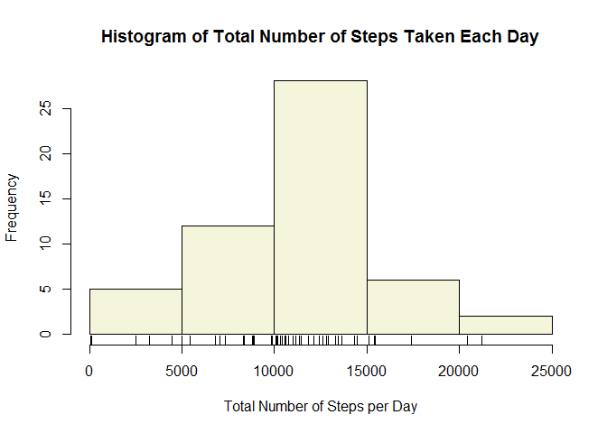
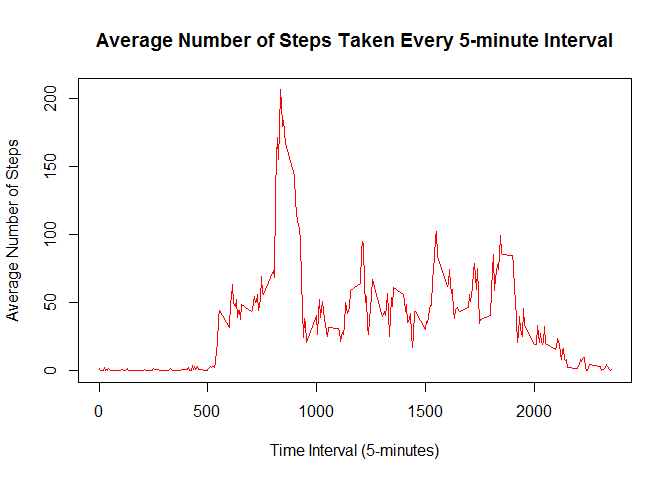
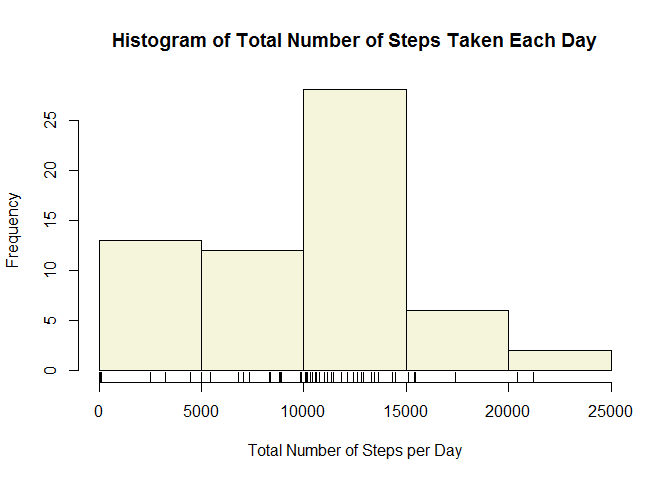
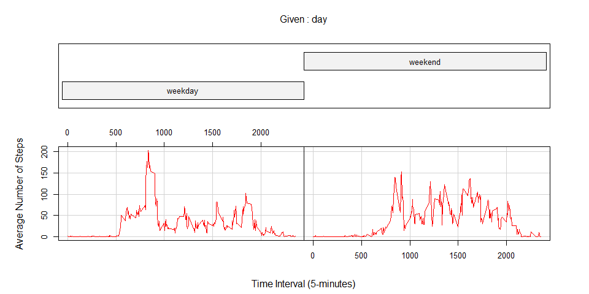

# **Reproducible Research: Peer Assessment 1**


**Jayson Trinchera**  
**August 23, 2016**  
**Last updated 2016-08-23 04:45:13 using R version 3.3.1 (2016-06-21)**  


## **Loading and preprocessing the data**  


```r
if(!file.exists("./activity.csv")) {
  fileUrl <- "https://d396qusza40orc.cloudfront.net/repdata%2Fdata%2Factivity.zip"
  download.file(fileUrl, destfile="./activity.zip")
  unzip(zipfile="./activity.zip")
}

data <- read.csv("activity.csv")

# Changes date variable into date format
data$date <- as.Date(as.character(data$date), "%Y-%m-%d")
```

## **What is the mean total number of steps taken per day?**  

### Calculate the total number of steps taken per day  


```r
totalDailySteps <- with(data, tapply(steps, date, sum, na.rm = F))
head(totalDailySteps)
```

```
## 2012-10-01 2012-10-02 2012-10-03 2012-10-04 2012-10-05 2012-10-06 
##         NA        126      11352      12116      13294      15420
```

### Make a histogram of the total number of steps taken each day  


```r
hist(totalDailySteps, col="beige", xlab="Total Number of Steps per Day", main="Histogram of Total Number of Steps Taken Each Day")
rug(totalDailySteps)
```

<!-- -->

### Calculate and report the mean and median of the total number of steps taken per day  


```r
mean(totalDailySteps, na.rm = T)
```

[1] 10766.19

```r
median(totalDailySteps, na.rm = T)
```

[1] 10765

## **What is the average daily activity pattern?**  

### Make a time series plot of the 5-minute interval (x-axis) and the average number of steps taken, averaged across all days (y-axis)  


```r
meanIntervalSteps <- with(data, tapply(steps, interval, mean, na.rm = T))
with(data, plot(as.numeric(names(meanIntervalSteps)), meanIntervalSteps, type="l", col="red", xlab="Time Interval (5-minutes)", ylab="Average Number of Steps", main="Average Number of Steps Taken Every 5-minute Interval"))
```

<!-- -->

### Which 5-minute interval, on average across all the days in the dataset, contains the maximum number of steps?  


```r
names(which.max(meanIntervalSteps))
```

[1] "835"

## **Imputing missing values**  

### Calculate and report the total number of missing values in the dataset  


```r
sum(is.na(data))
```

[1] 2304

### Devise a strategy for filling in all of the missing values in the dataset  


```r
getmode <- function(v) {
   uniqv <- unique(v)
   uniqv[which.max(tabulate(match(v, uniqv)))]
}
```

### Create a new dataset that is equal to the original dataset but with the missing data filled in  


```r
data2 <- data
data2$steps[is.na(data2$steps)] <- getmode(data2$steps)
sum(is.na(data2))
```

[1] 0

### Make a histogram of the total number of steps taken each day  


```r
totalDailySteps2 <- with(data2, tapply(steps, date, sum))
hist(totalDailySteps2, col="beige", xlab="Total Number of Steps per Day", main="Histogram of Total Number of Steps Taken Each Day")
rug(totalDailySteps2)
```

<!-- -->

### Calculate and report the mean and median of the total number of steps taken per day


```r
mean(totalDailySteps2)
```

[1] 9354.23

```r
median(totalDailySteps2)
```

[1] 10395

## **Are there differences in activity patterns between weekdays and weekends?**  
### Create a new factor variable in the dataset with two levels - "weekday" and "weekend" indicating whether a given date is a weekday or weekend day  


```r
data2$day <- weekdays(data2$date)
data2$day[data2$day %in% c("Saturday", "Sunday")] <- "weekend"
data2$day[!data2$day %in% "weekend"] <- "weekday"
data2$day <- factor(data2$day, levels = c("weekday", "weekend"))
```

### Make a panel plot containing a time series plot of the 5-minute interval (x-axis) and the average number of steps taken, averaged across all weekday days or weekend days (y-axis)


```r
agg <- aggregate(data2$steps, by=list(data2$interval, data2$day), mean)
colnames(agg) <- c("interval", "day", "steps")
with(agg, coplot(steps ~ interval | day, type="l", col="red", xlab="Time Interval (5-minutes)", ylab="Average Number of Steps"))
```

<!-- -->

```r
with(agg, tapply(steps, day, summary))
```

```
## $weekday
##    Min. 1st Qu.  Median    Mean 3rd Qu.    Max. 
##   0.000   1.922  20.780  30.630  44.960 202.900 
## 
## $weekend
##     Min.  1st Qu.   Median     Mean  3rd Qu.     Max. 
##   0.0000   0.9688  28.0300  37.6900  66.1200 153.1000
```
